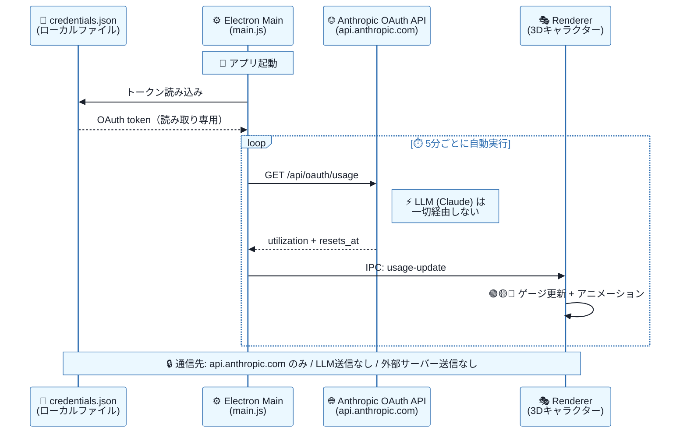

<div align="center">

# ⚡ CC-Usage

**Claude Code Usage Rate — 3D Desktop Gadget**

デスクトップ上に3Dキャラクターを常駐表示し
Claude Codeの使用率（5時間枠）をリアルタイム監視

`Electron` `Three.js` `Windows`

</div>

---

> [!NOTE]
> **このREADMEは Claude Code に読ませて自動セットアップさせる** ことを想定しています。
>
> Claude Code に以下のように指示してください（パスは実際の配置先に読み替え）：
>
> ```
> <このREADMEのフルパス> を読んで、セットアップ手順に従ってインストールして
> ```
>
> 手動セットアップは [こちら](#-手動セットアップpowershell)

---

## 🎭 キャラクター状態

使用率に応じてキャラクターの表情・モーション・ゲージ色がリアルタイムに変化します。

> 🟢 **`● 41% used  reset 17:00`** — **Happy** ご機嫌バウンス（余裕あり）
>
> 🟡 **`● 65% used  reset 17:00`** — **Worried** そわそわ足踏み（そろそろ注意）
>
> 🔴 **`● 92% used  reset 17:00`** — **Panic** ガクガク震え（制限間近！）

## ✨ 機能一覧

| | 機能 | 詳細 |
|:--:|------|------|
| 📊 | **正確な使用率表示** | `/usage` と同じデータソース（OAuth API） |
| 🌌 | **コンテキスト空間ダッシュボード** | 右クリック →「コンテキスト空間」で宇宙風の可視化 |
| 🎮 | **頭上ゲージバー** | 使用率を色付きバーでリアルタイム表示 |
| 🔄 | **5分間隔で自動更新** | トークン消費ゼロ（[詳細](#-セキュリティと仕組み)） |
| 🖱️ | **ドラッグ移動 / ホイール回転** | 自由に配置・視点変更 |
| 📋 | **右クリックメニュー** | リフレッシュ / 終了 |
| ⌨️ | **Ctrl+Shift+U** | 表示 / 非表示トグル |
| 🔲 | **システムトレイ常駐** | バックグラウンド動作 |
| 🔒 | **シングルインスタンス** | 多重起動防止 + ウィンドウ位置記憶 |

---

## 📋 前提条件

```
 ✅  Windows PC
 ✅  Node.js v18+（https://nodejs.org/ からLTS版をインストール）
 ✅  Claude Code インストール済み & ログイン済み
     └─ ~/.claude/.credentials.json が存在すること
```

---

## 🚀 セットアップ（Claude Code 向け）

以下の手順を順番に実行してください。

### Step 1 — ファイルコピー

```bash
mkdir -p ~/.claude/skills/cc-usage/scripts/src/renderer
cp cc-usage/SKILL.md ~/.claude/skills/cc-usage/
cp -r cc-usage/scripts/* ~/.claude/skills/cc-usage/scripts/
```

### Step 2 — 依存関係インストール

```bash
cd ~/.claude/skills/cc-usage/scripts
npm install
```

### Step 3 — 動作確認

```bash
cd ~/.claude/skills/cc-usage/scripts && npx electron .
```

> ガジェットが表示され、使用率 % とリセット時間が出れば成功です。

---

## 🖥️ 手動セットアップ（PowerShell）

<details>
<summary>▶ Claude Codeを使わず手動でセットアップする場合はこちら</summary>

```powershell
# 1. スキルディレクトリ作成
$skillDir = "$env:USERPROFILE\.claude\skills\cc-usage"
New-Item -ItemType Directory -Force -Path "$skillDir\scripts\src\renderer"

# 2. ファイルコピー（このREADMEと同じフォルダから実行）
Copy-Item "cc-usage\SKILL.md" "$skillDir\" -Force
Copy-Item "cc-usage\scripts\main.js","cc-usage\scripts\preload.js","cc-usage\scripts\usage-fetcher.js","cc-usage\scripts\package.json" "$skillDir\scripts\" -Force
Copy-Item "cc-usage\scripts\src\renderer\*" "$skillDir\scripts\src\renderer\" -Force

# 3. 依存関係インストール
Set-Location "$skillDir\scripts"
npm install

# 4. 動作確認
npx electron .
```

</details>

---

## ▶️ 起動

```
 Claude Code  ➜  /cc-usage start
 ターミナル   ➜  cd ~/.claude/skills/cc-usage/scripts && npx electron .
```

## 🎮 操作

```
 🖱️ 左ドラッグ        ➜  ウィンドウ移動
 🔄 マウスホイール     ➜  キャラクター回転（左右）
 🔄 Shift+ホイール     ➜  キャラクター回転（上下）
 📋 右クリック         ➜  メニュー（リフレッシュ / 終了）
 ⌨️ Ctrl+Shift+U      ➜  表示 / 非表示トグル
 🔲 トレイアイコン     ➜  表示 / 非表示トグル
```

---

## 📁 ファイル構成

```
~/.claude/skills/cc-usage/
├── SKILL.md                            # スキル定義
└── scripts/
    ├── package.json                    # electron, three.js
    ├── main.js                         # Electron メインプロセス
    ├── preload.js                      # IPC ブリッジ（3Dキャラ用）
    ├── preload-dashboard.js            # IPC ブリッジ（ダッシュボード用）
    ├── usage-fetcher.js                # OAuth API 使用率取得
    ├── context/
    │   ├── data-provider.js            # プロバイダーインターフェース
    │   ├── cli-provider.js             # claude -p "/context" 実行
    │   ├── context-parser.js           # /context 出力パーサー
    │   ├── mock-provider.js            # モックデータ（開発用）
    │   └── session-provider.js         # JSONL セッション検出・読み取り
    ├── node_modules/                   # npm install で生成
    └── src/renderer/
        ├── index.html                  # 3D キャンバス + バッジ
        ├── character.js                # Three.js キャラクター + ゲージ
        ├── app.js                      # ウィンドウ制御 + 表示更新
        ├── dashboard-window.html       # ダッシュボードウィンドウ
        ├── dashboard.js                # Cosmos/Chart/Treemap 描画エンジン
        └── dashboard.css               # ダッシュボード専用スタイル
```

---

## 🌌 コンテキスト空間ダッシュボード

右クリック →「コンテキスト空間」で、コンテキストウィンドウの使用状況を宇宙空間風に可視化します。

### 3つのビュー

| ビュー | 説明 |
|--------|------|
| **Cosmos**（デフォルト） | 各カテゴリを星雲として表示、オーロラプラズマリボンで接続 |
| **Chart** | ドーナツチャート + 凡例 + サマリーカード |
| **Space Map** | Treemap（面積 = トークン量） |

### データ取得方式

- **baseline**（System prompt / System tools / Memory files / Skills）: `claude -p "/context"` で取得
- **Messages**: JSONL ファイル（`~/.claude/projects/{project}/{session}.jsonl`）の `cache_read + cache_creation` から baseline を引いて算出
- 10 秒間隔で JSONL ファイル変更を検知し自動更新

### 制約事項

> [!IMPORTANT]
> - **`/compact` または `/clear` を実行した後は、cc-usage を再起動してください。** セッション ID が変わるため、自動追従ができません。
> - Messages の値は `/context` と比べて約 1-2K トークンの誤差があります（JSONL キャッシュ値と `/context` 推定値の計算方法の違いによる構造的な差）。

---

## 🔐 セキュリティと仕組み

### データフロー



### セキュリティサマリー

```
 🔑  OAuthトークン     ローカル読み取りのみ。外部送信しない
 🌐  通信先            api.anthropic.com（Anthropic公式）のみ
 🚫  LLMへの送信       なし。Claude API は一切呼び出さない
 📄  取得データ        使用率（%）+ リセット時刻のみ
 💬  会話内容          アクセスしない。プロンプト・個人データ一切不参照
 💰  トークン消費      ゼロ。使用率照会は Claude API とは別エンドポイント
 📝  credentials.json  Claude Code がログイン時に作成する既存ファイル
                       本ツールは読み取り専用（書き込み・変更なし）
```

<details>
<summary>▶ API エンドポイント詳細</summary>

```
GET https://api.anthropic.com/api/oauth/usage
Authorization: Bearer <OAuth token>
anthropic-beta: oauth-2025-04-20
```

レスポンス例:
```json
{
  "five_hour":  { "utilization": 17.0, "resets_at": "2026-02-28T07:59:59.000000+00:00" },
  "seven_day":  { "utilization": 26.0, "resets_at": "2026-03-05T14:59:59.000000+00:00" },
  "extra_usage": { "is_enabled": true, "monthly_limit": 100, "used_credits": 5.2, "utilization": 5.2 }
}
```

</details>

### アーキテクチャ

```
 Electron    200×200px 透明フレームレスウィンドウ、常に最前面
 Three.js    WebGL 3D レンダリング
 IPC         メインプロセス（データ取得）→ レンダラー（表示更新）
```

---

## ❓ FAQ

<details>
<summary><b>💰 トークン（API使用量）は消費しますか？</b></summary>

いいえ。OAuth の使用率照会API（`/api/oauth/usage`）を呼び出しており、Claude API（LLM）の呼び出しではありません。5分間隔の自動更新を含め、使用量への影響はゼロです。

</details>

<details>
<summary><b>🔑 OAuthトークンは安全ですか？</b></summary>

`~/.claude/.credentials.json` からトークンを読み取り、`api.anthropic.com`（Anthropic公式API）にのみ送信します。それ以外のサーバーやLLM（Claude）には一切送信しません。これはClaude Code自体が `/usage` コマンドで行っている通信と同じです。

</details>

<details>
<summary><b>📝 credentials.json はこのツールが作るものですか？</b></summary>

いいえ。Claude Code 自体がログイン時に自動作成する既存ファイルです。本ツールは読み取り専用でアクセスし、書き込みや変更は一切行いません。

</details>

<details>
<summary><b>💬 会話内容やプロンプトにアクセスしますか？</b></summary>

いいえ。取得するのは使用率（%）とリセット時刻のみです。会話内容、プロンプト、その他の個人データには一切アクセスしません。

</details>

<details>
<summary><b>📊 /usage コマンドと表示値が異なることはありますか？</b></summary>

同じAPIエンドポイントから取得しているため基本的に一致します。自動更新の間隔（5分）により若干のタイムラグが生じることがあります。右クリック →「Refresh Usage」で即時更新可能です。

</details>

<details>
<summary><b>⏱️ 更新間隔を変更できますか？</b></summary>

`scripts/main.js` の `FETCH_INTERVAL_MS`（デフォルト: 5分）を変更してください。トークン消費ゼロなので短くしても問題ありません。

</details>

<details>
<summary><b>🗑️ アンインストールするには？</b></summary>

以下を削除してください：
1. `~/.claude/skills/cc-usage/`（フォルダごと）
2. `%APPDATA%/cc-usage/cc-usage-config.json`（ウィンドウ位置記憶、なくても可）

</details>

<details>
<summary><b>🖥️ 他のPCやMacで使えますか？</b></summary>

現在は Windows 向けです。Electron + Node.js ベースのため原理的には Mac/Linux でも動作可能ですが、テストはしていません。

</details>

---

<div align="center">

**MIT License**

</div>
